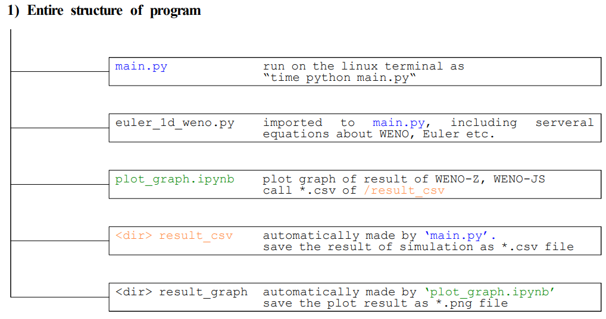
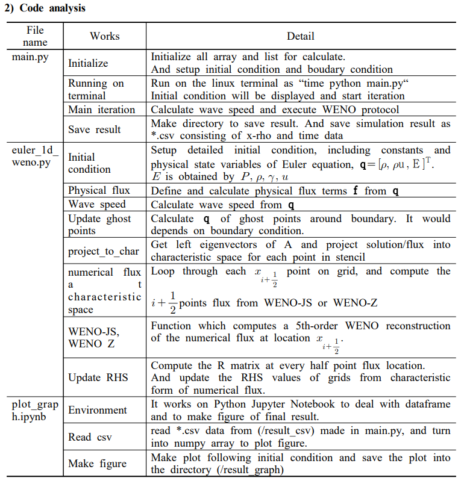

# WENO-Z-WENO-JS-for-1D-euler
Here is a program for WENO-Z and WENO-JS scheme for 1D euler equation of various initial condition.   

(LAX, SOD, 123, blastswave, Shockdenstiy problems)   

There are not exact solutions.   

Instead, you can setup enumerous Nx for WENO-Z as exact solution. 

## Reference :

>[1] G.S. Jiang, C.W. Shu, Efficient implementation of weighted ENO schemes, J. Journal of Computational Physics, 1996, 126:202-228   
>[2] A.K. Henrick, T.D. Aslam, J.M. Powers, Mapped weighted essentially non-oscillatory schemes:     
achieving optimal order near critical points, J. Journal of Computational Physics, 2005, 207:542-567   
>[3] Borges R, Carmona M, Costa B, Don W S, An improved weighted essentially non-oscillatory scheme for hyperbolic conservation laws,    
J. Journal of Computational Physics, 2008, 227:3191-3211.   
>[4] Lin Fu. A very-high-order TENO scheme for all-speed gas dynamics and turbulence, J. Journal of Computational Physics, 2019, 244:117-131   
>[5] B.Sullivan, S. R. Murthy, University of Illinois (2018), https://github.com/btsllvn2/weno-1d-euler

   
   
